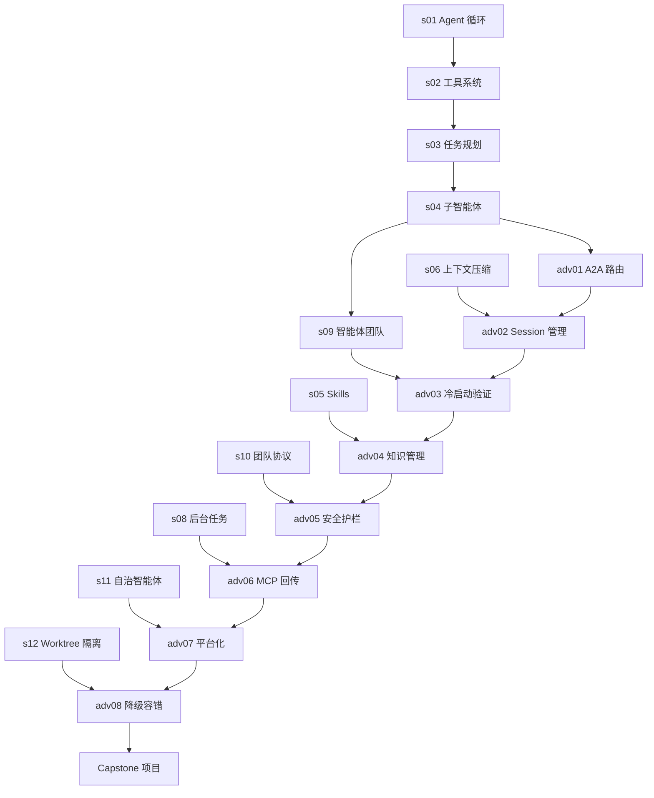

# 🗺️ 学习路径地图

> 从入门到精通，清晰的学习路线

---

## 📊 完整学习路径

```
┌─────────────────────────────────────────────────────────────────┐
│                    阶段 1：基础核心 (必学)                        │
├─────────────────────────────────────────────────────────────────┤
│                                                                 │
│  s01 (Agent 循环)                                                │
│    │                                                            │
│    └─> s02 (工具系统)                                            │
│          │                                                      │
│          └─> s03 (任务规划)                                      │
│                │                                                │
│                └─> s04 (子智能体) ──┬──> s09 (智能体团队)         │
│                                     │       │                   │
│                                     │       └─> s10 (团队协议)   │
│                                     │             │             │
│                                     │             └─> s11 (自治) │
│                                     │                   │       │
│                                     └─> s06 (上下文压缩)         │
│                                           │                     │
│                                           └─> s07 (任务系统)     │
│                                                 │               │
│                                                 └─> s08 (后台)   │
│                                                       │         │
│                                                       └─> s12 (隔离)
│
└─────────────────────────────────────────────────────────────────┘
                              │
                              ▼
┌─────────────────────────────────────────────────────────────────┐
│                   阶段 2：进阶应用 (融合 Cat Café)                 │
├─────────────────────────────────────────────────────────────────┤
│                                                                 │
│  adv01 (A2A 路由) ← s04 + Cat Café 04                            │
│    │                                                            │
│    └─> adv02 (Session) ← s06 + Cat Café 08                      │
│          │                                                      │
│          └─> adv03 (冷启动) ← s09 + Cat Café 09                 │
│                │                                                │
│                └─> adv04 (知识管理) ← s05 + Cat Café 10         │
│                      │                                          │
│                      └─> adv05 (安全护栏) ← s10 + Cat Café 02/06│
│                            │                                    │
│                            └─> adv06 (MCP 回传) ← s08 + Cat Café 05
│                                  │                              │
│                                  └─> adv07 (平台化) ← s11 + Cat Café 07
│                                        │                        │
│                                        └─> adv08 (容错) ← s12 + Cat Café 11
│
└─────────────────────────────────────────────────────────────────┘
                              │
                              ▼
┌─────────────────────────────────────────────────────────────────┐
│                    阶段 3：实战项目 (Capstone)                    │
├─────────────────────────────────────────────────────────────────┤
│                                                                 │
│  项目 1：多 Agent 协作系统 (adv01 + s09 + s10)                     │
│  项目 2：客服对话系统 (adv02 + s06 + s11)                        │
│  项目 3：代码审查机器人 (adv03 + s02 + s10)                      │
│  项目 4：企业知识库 (adv04 + s05 + s07)                          │
│  项目 5：生产监控系统 (adv05 + s08 + s11)                        │
│  项目 6：高可用 Agent 平台 (adv08 + adv07 + s12)                  │
│                                                                 │
└─────────────────────────────────────────────────────────────────┘
```

---

## 🎯 分角色学习路径

### 👶 初学者（0 基础）

**目标：** 3 周内掌握 Agent 开发核心能力

```
第 1 周：基础入门
├─ s01 (Agent 循环) - 1 天
├─ s02 (工具系统) - 2 天
└─ s03 (任务规划) - 2 天

第 2 周：核心能力
├─ s04 (子智能体) - 2 天
├─ s06 (上下文压缩) - 2 天
└─ s09 (智能体团队) - 2 天

第 3 周：进阶入门
├─ adv01 (A2A 路由) - 2 天
├─ adv03 (冷启动验证) - 2 天
└─ 小项目：构建简单的多 Agent 系统 - 1 天
```

**推荐资源：**
- ✅ s01_notes.md - 核心概念
- ✅ s02_tool_use.py - 代码示例
- ✅ adv01_a2a_router.py - 实战代码

---

### 👨‍💻 进阶开发者（有 Python 基础）

**目标：** 2 月内构建生产级 Agent 系统

```
第 1-2 周：快速过基础
├─ s01-s04 (核心循环) - 3 天
├─ s06-s09 (协作系统) - 4 天
└─ s10-s12 (生产特性) - 3 天

第 3-6 周：进阶课程
├─ adv01-adv04 (核心进阶) - 10 天
├─ adv05-adv08 (生产特性) - 10 天
└─ 实战项目 - 10 天

第 7-8 周：企业级能力
├─ 可观测性系统 - 3 天
├─ RAG 集成 - 4 天
└─ 容器化部署 - 3 天
```

**推荐资源：**
- ✅ docs/ANALYSIS-AND-ROADMAP.md - 企业级对比
- ✅ advanced/examples/ - 完整示例
- ✅ skills/ - Skill 系统

---

### 🏢 企业用户（生产部署）

**目标：** 1 月内落地企业级 Agent 应用

```
第 1 周：评估与规划
├─ 阅读 ANALYSIS-AND-ROADMAP.md - 1 天
├─ 评估现有系统差距 - 2 天
└─ 制定实施计划 - 2 天

第 2 周：核心能力
├─ adv03 (冷启动验证) - 2 天
├─ adv05 (安全护栏) - 2 天
└─ adv08 (降级容错) - 2 天

第 3-4 周：集成与部署
├─ 可观测性集成 - 3 天
├─ RAG 系统集成 - 4 天
├─ 容器化部署 - 3 天
└─ 生产环境测试 - 2 天
```

**推荐资源：**
- ✅ docs/ANALYSIS-AND-ROADMAP.md - 企业级指南
- ✅ advanced/docs/adv05-production-guards.md - 安全护栏
- ✅ advanced/docs/adv08-fault-tolerance.md - 容错设计

---

## 📋 能力矩阵

| 能力维度 | s01 | s02 | s03 | s04 | s06 | s09 | adv01 | adv03 | adv05 | adv08 |
|----------|-----|-----|-----|-----|-----|-----|-------|-------|-------|-------|
| Agent 循环 | ✅ | ✅ | ✅ | ✅ | ✅ | ✅ | ✅ | ✅ | ✅ | ✅ |
| 工具调用 | ⚠️ | ✅ | ✅ | ✅ | - | - | - | - | - | - |
| 任务规划 | - | - | ✅ | ✅ | - | ✅ | ✅ | ✅ | - | - |
| 多 Agent | - | - | - | ✅ | - | ✅ | ✅ | ✅ | ✅ | ✅ |
| 上下文管理 | - | - | - | ⚠️ | ✅ | ✅ | ✅ | ✅ | - | - |
| 生产部署 | - | - | - | - | - | - | ⚠️ | ⚠️ | ✅ | ✅ |
| 安全护栏 | - | - | - | - | - | - | ⚠️ | ✅ | ✅ | ✅ |

**图例：** ✅ 精通 | ⚠️ 了解 | - 未涉及

---

## 🎓 认证体系

### 🐱 见习铲屎官

**要求：**
- ✅ 完成 s01-s04
- ✅ 完成 adv01
- ✅ 通过基础测试（80 分+）

**权益：**
- 访问私有 Discord
- 参与社区讨论
- 获取学习资源

---

### 🐱🐱 资深铲屎官

**要求：**
- ✅ 完成 s01-s12
- ✅ 完成 adv01-adv06
- ✅ 完成 1 个实战项目
- ✅ 通过进阶测试（90 分+）

**权益：**
- 参与 Code Review
- 贡献代码权限
- 获取认证证书

---

### 🐱🐱🐱 猫咖大师

**要求：**
- ✅ 完成所有课程
- ✅ 完成 Capstone 项目
- ✅ 通过最终答辩
- ✅ 贡献 1 个 Skill 或改进

**权益：**
- 联合署名教程
- 技术顾问资格
- 永久会员权益

---

## 📚 课程前置依赖图



---

## 🚀 快速开始

### 1. 环境准备

```bash
# 克隆仓库
git clone https://github.com/simple-f/learn-claude-cod.git
cd learn-claude-cod

# 安装依赖
pip install -r requirements.txt

# 配置环境变量
cp .env.example .env
# 编辑 .env 填入你的 API Key
```

### 2. 开始学习

```bash
# 运行第一课
python s01_agent_loop.py

# 运行进阶课程
cd advanced/examples
python adv01_a2a_router.py
```

### 3. 加入社区

- 📖 阅读 [README.md](README.md)
- 💬 加入 Discord 社区
- 🐛 提交 Issue 和 PR

---

**持续更新中...**

_最后更新：2026-03-12_
